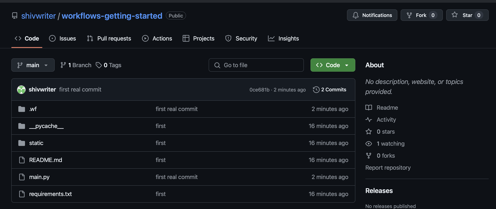
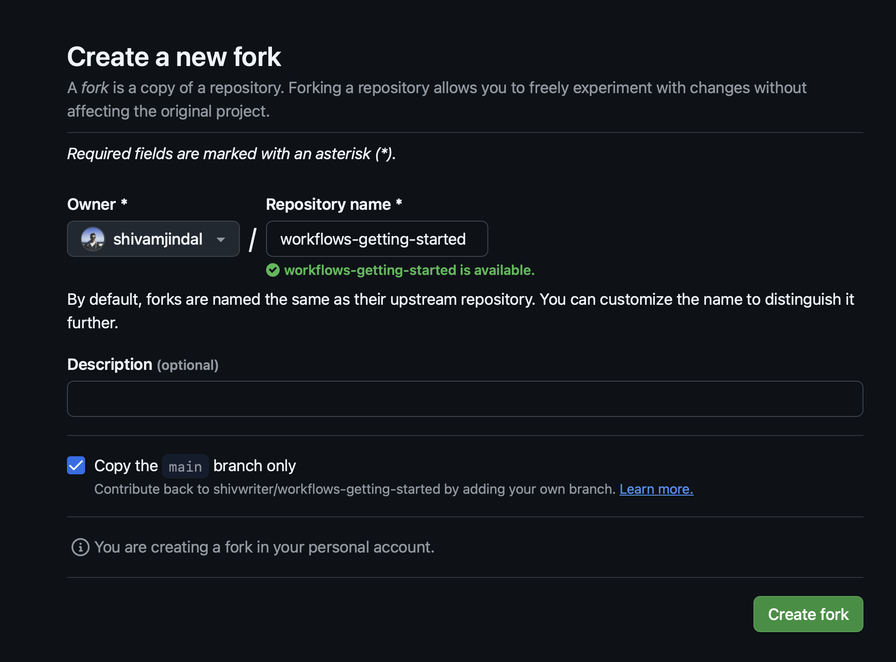

# Getting started with workflows
**First: PLEASE record your screen as you are going through this exercise and send it to Matan**

**If you can't get to the point of editing and seeing framework following the instructions below, please message @Shivam Jindal**

1. Fork this repo (see screenshots below on how to do so)

   a. Click `Fork` in the top right 
   b. Complete forking 

3.  Set up a github codespace for your forked repository. See the video [here](https://www.loom.com/share/3ec11a67435a43ed8c6e9efaab99e0bc?sid=072b2cf5-4ed7-4ee2-af19-b1c206f81172) for how to do so.
	1.  Run the command `pip install writer`
	2.  Run the command `writer edit .` **Don't forget the period at the end!!!**
	3.  Click the green `Open in browser` button that appears in the bottom right hand side
